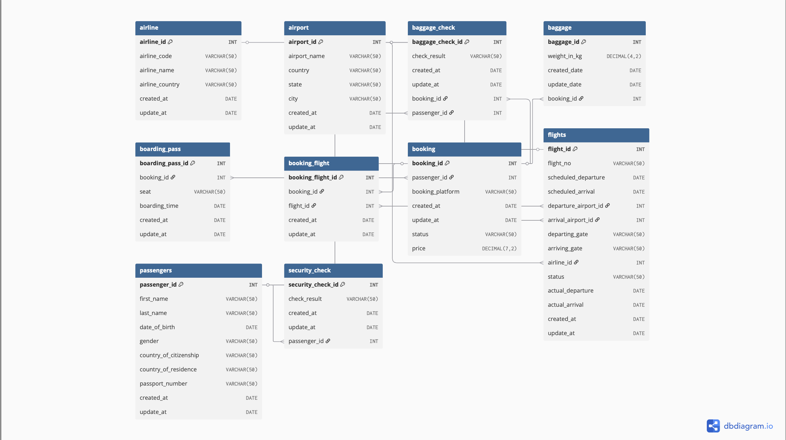

# SkyTrack Solutions

**SkyTrack** is a modern airline analytics platform that helps identify flight delay patterns, forecast route utilization, and optimize airline operations.



## Features

- Flight count by airlines
- Booking price analysis
- Passenger distribution by country
- Baggage weight statistics
- Flight status tracking
- Security check results
- Passenger demographics
- Booking platform statistics
- Airport distribution

## Requirements

- **Python 3.7+**
- **PostgreSQL 12+**
- **psycopg2-binary** (for database connection)

## Quick Start

### 1. Clone Repository
```bash
git clone https://github.com/your-username/skytrack-solutions.git
cd skytrack-solutions
```

### 2. Install Dependencies
```bash
pip install psycopg2-binary
```

### 3. Database Setup
Create PostgreSQL database named `airport_analytics` and import your schema

### 4. Connection Configuration
Update connection parameters in `main.py`:
```python
host = 'localhost'        
port = '5432'            
database = 'airport_analytics'  
user = 'postgres'        
password = 'your_password'      
```

### 5. Run Analysis
```bash
python main.py
```

## What the Program Does

### Analysis Structure:
1. **Connection Check** - displays all tables in database
2. **Top Airlines** - ranking by number of flights
3. **Price Analytics** - average, minimum and maximum prices
4. **Business Geography** - international transportation analysis
5. **Operational Statistics** - baggage, security, demographics
6. **Business Analytics** - sales platforms and infrastructure

### Sample Output:
```
Data from Database:- [('airline',), ('airport',), ('baggage',), ...]

1 - FLIGHT COUNT BY AIRLINES:
   Airline 1: 32 flights
   Airline 43: 31 flights
   ...

2 - AVERAGE/MIN/MAX PRICE BY BOOKING STATUS:
   Status 'confirmed': 150 bookings, average price: 4500.00
   Status 'cancelled': 25 bookings, average price: 3200.00
   ...
```

## Project Structure

```
skytrack-solutions/
├── main.py              # Main analysis file
├── ERD.png             # Database schema diagram
└── README.md           # This file
```

## Use Cases

- **Airlines**: optimize route networks and pricing
- **Airports**: plan capacity and resource allocation
- **Travel Agencies**: analyze demand and trends in air transportation
- **Analysts**: research the aviation transportation market

## Configuration and Extension

### Export Results:
To save results to file add:
```python
import csv
# Save to CSV
with open('results.csv', 'w', newline='') as file:
    writer = csv.writer(file)
    writer.writerows(record)
```

